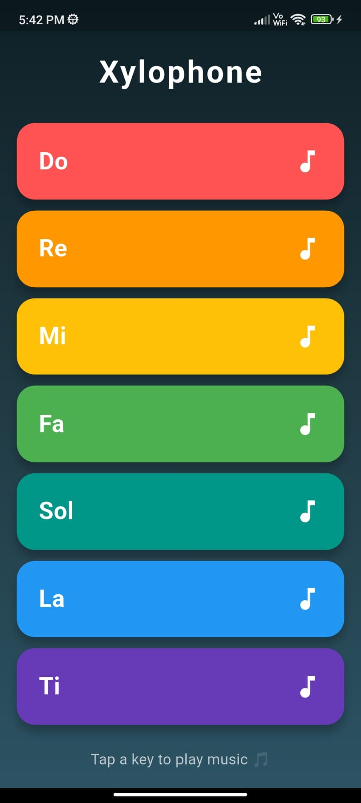

# 🎹 Xylophone Player

A modern Flutter application that simulates a xylophone with interactive colorful keys and real-time audio playback. Tap any key to play its corresponding musical note and enjoy a simple, responsive user experience.

---

## 📱 App Preview

<p align="center">
  
</p>

---

## ✨ Features

- 🎵 Play 7 different musical notes
- 🎨 Modern and colorful user interface
- 📱 Responsive Flutter layout
- 🔊 Real-time audio playback using the `audioplayers` package
- ⚡ Smooth and interactive key animations
- 🌈 Gradient background with polished UI

---

## 🛠️ Built With

- Flutter
- Dart
- audioplayers

---

## 📂 Project Structure

```
lib/
 └── main.dart

assets/
 ├── note1.wav
 ├── note2.wav
 ├── note3.wav
 ├── note4.wav
 ├── note5.wav
 ├── note6.wav
 ├── note7.wav
 └── xylophone_app.jpeg
```

---

## 🚀 Getting Started

### Clone the repository

```bash
git clone https://github.com/your-username/xylophone-player.git
```

### Navigate to the project

```bash
cd xylophone-player
```

### Install dependencies

```bash
flutter pub get
```

### Run the application

```bash
flutter run
```

---

## 📦 Dependencies

```yaml
dependencies:
  flutter:
    sdk: flutter
  audioplayers: ^6.5.0
```

---

## 👨‍💻 Author

**Jithin P Joji**

- GitHub: https://github.com/jithin2501
- LinkedIn: https://www.linkedin.com/in/jithin05/

---

## ⭐ Support

If you found this project helpful, consider giving it a ⭐ on GitHub!